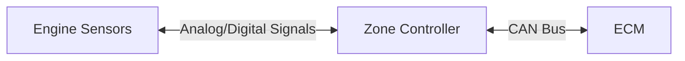
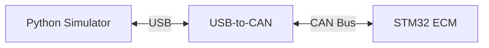

# Hardware-in-the-Loop Engine Simulator
This project uses Python and a USB-to-CAN module to simulate engine sensor data 
and transmit it to an STM32-based Engine Control Module (ECM) written in C. The 
ECM responds with control outputs to maintain engine stability given a variable 
throttle input. This mirrors modern distributed vehicle architectures, where a 
Zone Controller digitises analog sensor signals before forwarding them to the ECM 
over CAN bus.

> IN EARLY DEVELOPMENT - there are no guarantees anything works yet.

## Real-World Architecture

## Simulator Architecture

## Hardware
- STM32 development board
- CAN controller and transceiver unit
- USB-to-CAN adapter (Canable based)
- Potentiometer (Throttle)

## Documentation
- [Simulator](simulator/README.md)
- [ECM](ecm/README.md)
- [CAN Specification](docs/can_spec.md)
