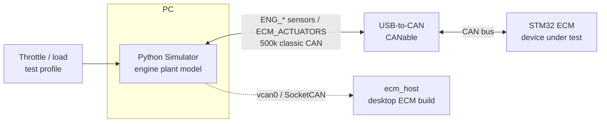

# Hardware-in-the-Loop Engine Simulator

This project simulates an engine and its ECM as a closed loop over CAN. A Python
simulator runs a real-time engine model (the plant) and transmits typical
sensor data — RPM, MAF, throttle, intake/coolant temp, wideband O2/λ, knock — over
CAN. On the other end an ECM written in C (the device under test) reads those
sensors and commands fuel and spark back to keep the engine stable across a
variable throttle. The ECM runs both as a desktop process (for hardware-free
testing) and, unchanged, as STM32 firmware talking to a USB-to-CAN adapter (a CANable).

## Architecture


```mermaid
graph LR
    D[Throttle / load<br/>test profile] --> A
    subgraph PC
      A[Python Simulator<br/>engine plant model]
    end
    A <-->|ENG_* sensors / ECM_ACTUATORS<br/>500k classic CAN| B[USB-to-CAN<br/>CANable]
    B <-->|CAN bus| C[STM32 ECM<br/>device under test]
    A -. vcan0 / SocketCAN .-> C2[ecm_host<br/>desktop ECM build]
```

The wire contract (IDs, signal scaling) lives in [`docs/engine.dbc`](docs/engine.dbc)
and is described in [`docs/can_spec.md`](docs/can_spec.md). The simulator loads the
DBC directly; the C ECM mirrors it, and a test checks the two are byte-identical.

## Quickstart (no hardware)

```bash
# 1. Python deps for the simulator
pip install -r simulator/requirements.txt

# 2. A virtual CAN bus (needs sudo; for a real CANable, skip this and use can0)
./tools/vcan_up.sh vcan0

# 3. Run the ECM (DUT) and the engine simulator (plant) together
./tools/run_hil.sh vcan0 drive
```

You'll see the engine crank, idle, and respond to the throttle profile while the
ECM holds closed-loop λ, manages knock, and limits revs. On real hardware, bring
up the CANable instead (`sudo ip link set can0 up type can bitrate 500000`) and
use `can0`.

## What it demonstrates

- **Starting & idle** — cranking enrichment, then a spark-based idle-speed governor.
- **Closed-loop fueling** — wideband-λ PI trim to stoich once warm; open-loop
  warmup and cold-start enrichment when cold; power enrichment at high load.
- **Spark & knock control** — MBT-edge base timing with knock-feedback retard.
- **Protection** — overrun fuel cut and a rev limiter.
- **Realistic plant** — manifold filling dynamics, wall-film fuel lag, O2 transport
  delay, torsional crank-speed ripple, thermal warmup.

## Components

| Path | What |
|------|------|
| [`simulator/`](simulator/README.md) | Python engine plant model + CAN I/O (the engine) |
| [`ecm/`](ecm/README.md) | Portable C ECM: control core + SocketCAN/STM32 backends (the DUT) |
| [`docs/`](docs/can_spec.md) | CAN specification and the DBC |
| `tools/` | vcan setup + a one-command HIL launcher |

## Tests (hardware-free)

The C ECM is verified against the Python plant without a bus:

```bash
make -C ecm lib
python3 ecm/tests/test_byte_compat.py     # C packing == cantools/DBC
python3 ecm/tests/test_closed_loop.py     # compiled C ECM controls the plant
```

## Physical Configuration

![Image showing three pieces of hardware connected to one another. The one on the far left with USB, then a twisted green and yellow cable connecting it in the middle.][docs/layout.png]
